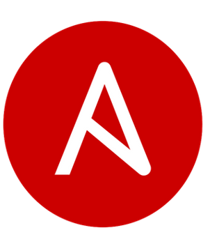

### Hi, my name is Christian - aka [ScriptingChris][website] 👋 

 

### Website
Be sure to check out my Web app: https://scriptingchris.tech, which i build from scratch using Python and with DevOps practices in mind. The Web app is build with a docker images running the frontend and is hosted in Azure App Services. The frontend is connected to the Backend build with Azure Functions, Azure API Management, and Azure Cosmos DB. The entire project is build in Azure with Bicep for Infrastructure as Code. And of course the entire build & Deployment process is automated with Github Actions pipelines

 

### Code Repositories
Now all public code repositories and projects i have build will be located in my Organization Github. Go check it out here: https://github.com/scriptingchris

 

### Gaining DevOps knowledge

In my daily job i work with administrating a hybrid environment containing, Windows, Linux, Azure and Microsoft 365.

I try to automate as much as possible, and for automations i rely PowerShell and Python, using Azure DevOps Pipelines, Azure Automations and Azure functions for running the automations.

I spend most of my spare time, learning about devops technologies. At the moment i am learning the following technologies:

- Azure
- Jenkins
- Ansible
- Kubernetes
- Terraform

 

### Goals for 2022

My goals for the year 2022 is to gain the following certifications:

- ⭐ AZ-900 - Azure Fundamentals ✅
- ⭐ AZ-104 - Azure Administrator
- ⭐ AZ-204 - Developing Solutions for Microsoft Azure
- ⭐ AZ-400 - Designing and Implementing Microsoft DevOps Solutions

 

### Certifications

 

### Connect with me:

[][website]
[][twitter]
[][linkedin]

 

<!--
### 📕 Latest Blog Posts

 BLOG-POST-LIST:START
- [Using a Raspberry Pi Kubernetes Cluster to help fight COVID-19 with Rosetta@Home](https://scriptingchris.tech/2022/01/15/running-rosettahome-on-raspberry-pi-kubernetes-cluster/)
- [Setting up a Raspberry Pi Kubernetes Cluster](https://scriptingchris.tech/2022/01/15/setting-up-a-raspberry-pi-kubernetes-cluster/)
- [Book Review: Windows Server Automation with PowerShell Cookbook](https://scriptingchris.tech/2021/10/22/book-review-windows-server-automation-with-powershell-cookbook/)
- [How to handle API Pagination with PowerShell](https://scriptingchris.tech/2021/10/11/handling-api-pagination-with-powershell/)
- [How To Setup a Private Powershell Repository](https://scriptingchris.tech/2021/08/31/how-to-setup-a-private-powershell-repository/)
BLOG-POST-LIST:END -->

[website]: https://scriptingchris.tech
[twitter]: https://twitter.com/_ScriptingChris
[linkedin]: https://linkedin.com/in/hoejsager
